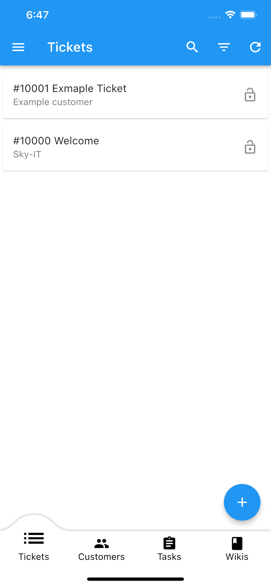
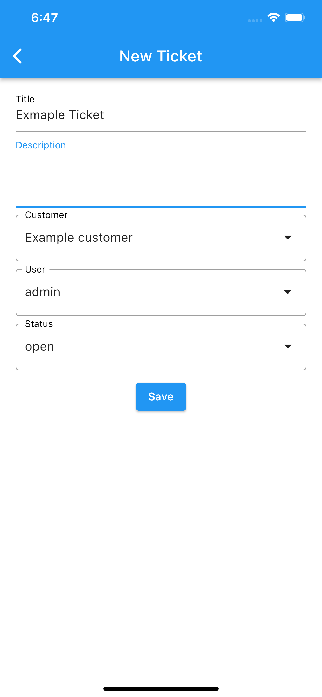
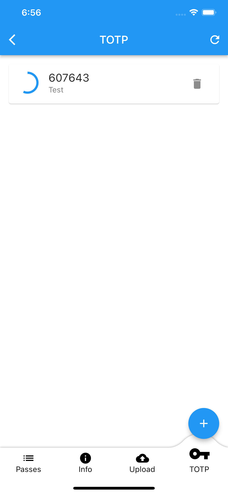

# Table of contents

- [🔧 Setup](#-setup)
  - [Simple Setup](#simple-setup)
  - [1️⃣ First Login](1%EF%B8%8F⃣-first-login)
- [🔒 SSL Setup](#-ssl-setup)
- [👑 Environment Variables](#-environment-variables)
  - [SkyManager-Frontend](#skymanager-frontend)
  - [Encryption](#encryption)
- [⚒️ Development](#%EF%B8%8F-development)
  - [🪲 Debug](#-debug)
  - [🏹 Build for Prod MultiArch](#-build-for-prod-multiarch)
- [▶️ DEMO](#%EF%B8%8F-demo)
- [💬 Feedback](#-feedback)
- [💿 Persistent Data](#-persistent-data)
- 👨‍💻 [Privacy Policy](#-privacy-policy)

# 🔧 Setup

## Simple Setup
1. Create docker-compose.yml file from below or Clone the Repo
2. **Change** the environment variables in the docker-compose.yml file:
   1. MYSQL_PASSWORD (skymanager-backend and db-service)
   2. <span style="color:red">MASTERKEY (Don't change after first use) </span>
   3. MYSQL_ROOT_PASSWORD (in db Service and the Healthcheck)
3.  Run `docker-compose up -d`
```yaml
version: "3.2"
services:
  skymanager-backend:
    image: skyface753/skymanager
    ports:
      - 8080:80
    volumes:
      - ./uploads:/usr/src/app/uploads # Persistent Storage
    environment:
      DB_HOST: db-service                     
      MYSQL_USER: dbUser
      MYSQL_DATABASE: dbName
      MYSQL_PASSWORD: dbPass # ChangeME
      MASTER_KEY: MasterKey # ChangeME
    restart: always
    depends_on:
      db-service:
        condition: service_healthy

  skymanager-frontend:
    image: skyface753/skymanager-frontend
    ports:
      - 80:80
    
  db-service:
    image: mariadb
    restart: always
    volumes:
      - ./DB-Data:/var/lib/mysql
    environment:
      MYSQL_ROOT_PASSWORD: ROOTMYSQL # ChangeME
      MYSQL_DATABASE: dbName
      MYSQL_USER: dbUser
      MYSQL_PASSWORD: dbPass # ChangeME
    healthcheck:
      test: ["CMD", "mysqladmin", "-uroot" , "-pROOTMYSQL" ,"ping", "-h", "localhost"]
      timeout: 5s
      retries: 10

```

## 1️⃣ First Login
URL: http://localhost:8080
Username: admin
Password: SkyManager


# 🔒 SSL Setup
If you want to use SSL, you need to use an official SSL certificate. (Self-Signed Certificates are not allowed by Frontend)
   1. Copy the certificate and key into a folder like "ssl-certs"
   2. Add Volume to docker-compose.yml:
      - `./ssl-certs:/usr/src/app/sslcert`
   3. Add these environment variables in the docker-compose.yml file:
      1. `SSL_CERT` -> `<Name of the certificate file.cert>`
      2. `SSL_KEY` -> `<Name of the key file.key>`
  

# 👑 Environment Variables

### SkyManager-Backend

| Required | Variable | Default | Description |
| -------- | -------- | ------- | ----------- |
| Yes | DB_HOST |  | Hostname of the Database |
| Yes | DB_USER |  | Username of the Database |
| Yes | DB_PASSWORD |  | Password of the Database |
| Yes | DB_NAME |  | Name of the Database |
| Yes | MASTER_KEY |  | Key to Encyrpt the Customer-Passwords |
| No  | SMTP_HOST |  | Hostname of the SMTP Server |
| No  | SMTP_PORT |  | Port of the SMTP Server |
| No  | SMTP_USER |  | Username of the SMTP Server |
| No  | SMTP_PASSWORD |  | Password of the SMTP Server |
| No  | SMTP_SECURE | false | Use SSL for the SMTP Server |
| No  | SMTP_SENDER | SMTP_USER | Email-Address of the Sender |
| No  | IMAP_USER |  | Username of the IMAP Server |
| No  | IMAP_PASSWORD |  | Password of the IMAP Server |
| No  | IMAP_HOST |  | Hostname of the IMAP Server |
| No  | IMAP_PORT |  | Port of the IMAP Server |
| No  | IMAP_TLS | false | Use SSL for the IMAP Server |
| No  | FRONTEND_URL |  | URL to the Frontend for Send-Mailer |    
| No  | SSL_KEY |  | Name of the SSL-Key-File |
| No  | SSL_CERT |  | Name of the SSL-Cert-File |

## SkyManager-Frontend

| Required | Variable | Default | Description |
| -------- | -------- | ------- | ----------- |
| No  | BACKEND_URL |  | URL to the Backend for Autofill |

## Encryption
MASTER_KEY to encrypt the password of the customes. 
<span style="color:red">*DONT REPLACE THIS KEY WHEN ALREADY SET*</span>.


# ⚒️ Development
## 🪲 Debug
1. Clone the Repo
2. Run `docker-compose -f docker-compose-debug.yml up -d --build`

## 🏹 Build for Prod MultiArch
#### Backend
`docker buildx build --push --platform linux/arm/v7,linux/arm64/v8,linux/amd64 -t skyface753/skymanager ./SkyManager-Backend`

#### Frontend
`docker buildx build --push --platform linux/arm/v7,linux/arm64/v8,linux/amd64 -t skyface753/skymanager-frontend ./skymanager_flutter`

# ▶️ DEMO
Check out the [Demo](https://skymanager.skyface753.de)
It recreates itself every 10 minutes.


|
|


# 💬 Feedback
Provide your feedback in the App (and Frontend) or create an Issue on [Github](https://github.com/skyface753/SkyManager)

# 💿 Persistent Data
SkyManager-Backend: 
```
/usr/src/app/uploads
/usr/src/app/sslcert
```
# 👨‍💻 [Privacy Policy](https://skymanager.net/index.php/skymanager-privacy-policy/)


<!-- # Android -->
<!--  -->
